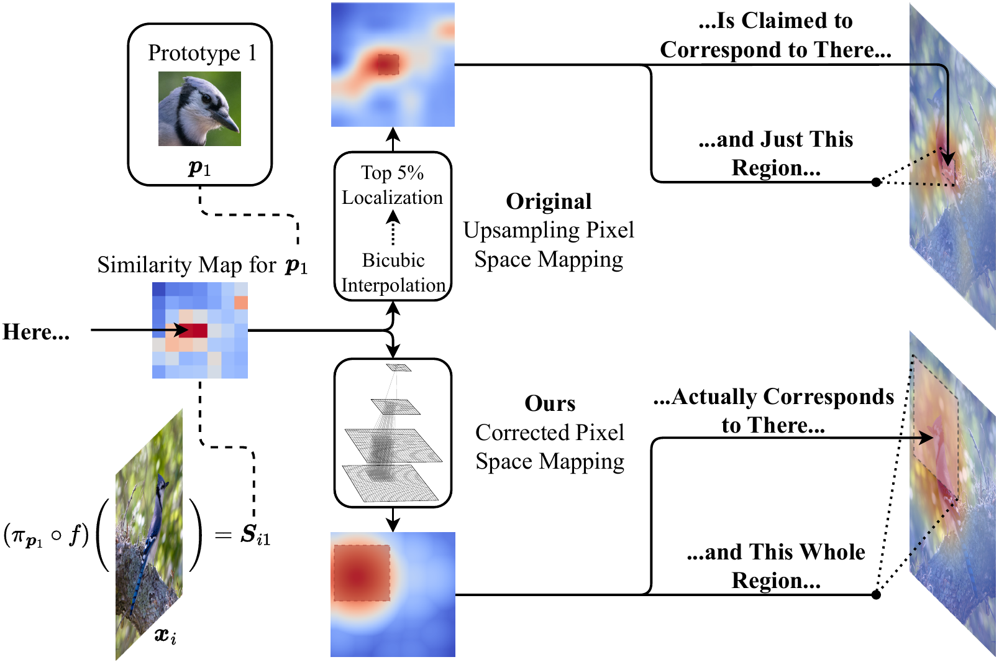
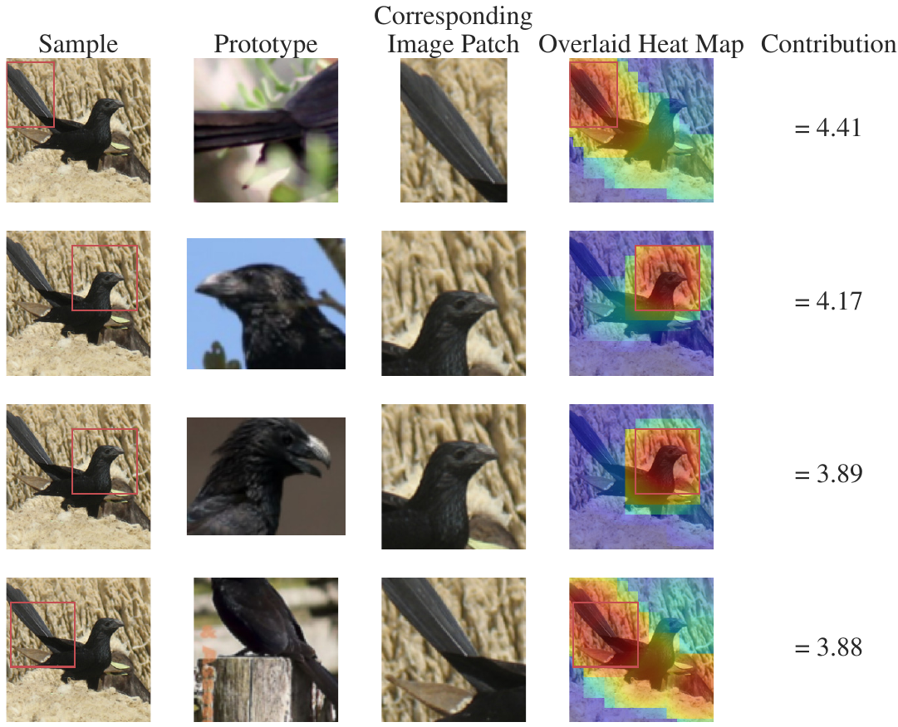

<!--
Copyright (c) 2023 Mitsubishi Electric Research Laboratories (MERL)

SPDX-License-Identifier: AGPL-3.0-or-later
-->

# PixPNet: Pixel-Grounded Prototypical Part Networks

This repository contains the code for the paper, _Pixel-Grounded Prototypical
Part Networks_ by Zachariah Carmichael, Suhas Lohit, Anoop Cherian, Michael
Jones, and Walter J Scheirer. **PixPNet** (**Pix**el-Grounded **P**rototypical
Part **Net**work) is an improvement upon existing prototypical part neural
networks (ProtoPartNNs): PixPNet _truly localizes to object parts_ (unlike other
approaches, including ProtoPNet), has quantitatively better interpretability,
and is competitive on image classification benchmarks.


<p align="center">
  
  
</p>

**Abstract**:

> Prototypical part neural networks (ProtoPartNNs), namely ProtoPNet and its
> derivatives, are an intrinsically interpretable approach to machine learning.
> Their prototype learning scheme enables intuitive explanations of the form,
> _this_ (prototype) looks like _that_ (testing image patch). But, does _this_
> actually look like _that_? In this work, we delve into why object part
> localization and associated heat maps in past work are misleading. Rather
> than localizing to object parts, existing ProtoPartNNs localize to the entire
> image, contrary to generated explanatory visualizations. We argue that
> detraction from these underlying issues is due to the alluring nature of
> visualizations and an over-reliance on intuition. To alleviate these issues,
> we devise new receptive field-based architectural constraints for meaningful
> localization and a principled pixel space mapping for ProtoPartNNs. To
> improve interpretability, we propose additional architectural improvements,
> including a simplified classification head. We also make additional
> corrections to ProtoPNet and its derivatives, such as the use of a validation
> set, rather than a test set, to evaluate generalization during training. Our
> approach, PixPNet (Pixel-grounded Prototypical part Network), is the **only**
> ProtoPartNN that truly learns and localizes to prototypical object parts. We
> demonstrate that PixPNet achieves quantifiably improved interpretability
> without sacrificing accuracy.

<!-- TOC -->
* [Installation](#installation)
* [Running](#running)
  * [Running PixPNet](#running-pixpnet)
    * [Overview](#overview)
    * [Verifying Your Installation](#verifying-your-installation)
    * [Training PixPNet](#training-pixpnet)
    * [Visualizing Explanations](#visualizing-explanations)
    * [Interpretability Evaluation](#interpretability-evaluation)
    * [Log Level](#log-level)
  * [Running "Goldilocks" Zone Experiments](#-goldilocks--zone-experiments)
* [License](#license)
* [Citation](#citation)
<!-- TOC -->

## Installation

After cloning this repository, the required packages listed in
`requirements.txt` need to be installed. They can be installed in a virtual
environment using tools such as `virtualenv` or `conda`.

Example of installation via `pip`:

```shell
pip install -r requirements.txt
```

## Running

There are two primary scripts and several notebooks included in this repository.

### Running PixPNet

#### Overview

To train a PixPNet, the `scripts/run_protonet.py` script should be used. To view
all the documented command-line options, run the following:

```shell
python scripts/run_protonet.py --help
```

These options can be specified in YAML config files for convenience. You can
see config file examples in the `configs/protonets/` directory.

The output of a run is by default stored in `logs/protonet` and is controlled by
the `--log-dir` option. The saved files have the following directory structure:

```text
logs/
└── protonet
    └── <dataset>
        └── protonet
            └── <timestamp>
                ├── csv
                │   └── version_0
                │       ├── checkpoints
                │       │   └── epoch=0-step=<step>.ckpt
                │       ├── hparams.yaml
                │       └── metrics.csv
                ├── results
                │   ├── config.yaml
                │   ├── model_info.yaml
                │   └── scores.yaml
                └── tensorboard
                    └── version_0
                        ├── events.out.tfevents.<id.host>
                        ├── events.out.tfevents.<id.host>
                        └── hparams.yaml
```

The following explains each file of interest:

- `config.yaml`: the full configuration of the run
- `model_info.yaml`: statistics of the model, including train/test run times,
model MACS, model size, and parameters
- `scores.yaml`: the scores on the test set, e.g., accuracy
- `tensorboard/` files: events that can be visualized using `tensorboard`
- `epoch=0-step=<step>.ckpt`: the final model checkpoint that be loaded
- `metrics.csv`: logged metrics of the train and validation splits in CSV form

#### Verifying Your Installation

To test that your installation is working properly, you can run a dummy version
of the training on CUB-200-2011 (the script will download the data for you). In
this version, the batch size, epochs, augmentation factor, and some PixPNet
parameters are reduced. To test your installation:

```shell
python scripts/run_protonet.py -c configs/protonets/proto-cub200224-dummy.yaml
```

You should expect the reported `test_accuracy` to be quite low. This is
expected as this a dummy configuration to verify your installation.

Alternatively you can test all entry scripts by running `pytest`:

```shell
pytest
```

#### Training PixPNet

To train PixPNet on CUB-200-2011, the following should be run:

```shell
python scripts/run_protonet.py -c configs/protonets/proto-cub200224.yaml
```

Results for other architectures can be given by changing the
`--model.feature-extractor` and `--model.feature-layer` options either through
the command line or the YAML config file. Note that command line options take
precedence over config file options.

For Stanford Cars, simply use the config `configs/protonets/proto-cars224.yaml`
instead.

#### Visualizing Explanations

Once a PixPNet has been trained, its explanations can be visualized with the
notebook `notebooks/explanation_viz.ipynb`. The notebook indicates where the
result path (log directory) should be inserted.

#### Interpretability Evaluation

To evaluate the interpretability of a trained PixPNet, use the notebook
`notebooks/interpretability_evaluation.ipynb`. The notebook evaluates the
consistency, stability and relevance ordering test metrics for several
pixel space mappings: ours, upsampling (original from ProtoPNet), and random.
To evaluate the prototypical relevance propagation (PRP) pixel space mapping,
the `notebooks/interpretability_evaluation_prp.ipynb` notebook must be used.
The result of this notebook can be loaded by the former notebook for
visualization. The reason for this is that the external PRP code base modifies
models in-place. Both notebooks indicate where the result path (log directory)
should be inserted.

#### Log Level
The log level (verbosity) can be controlled using the `PIXPNET_LOG_LEVEL`
environmental variable. Example usage:

```shell
PIXPNET_LOG_LEVEL="INFO" python scripts/run_protonet.py -c ...
```


### Running "Goldilocks" Zone Experiments

These experiments are described in the paper. Therein, various architectures
are evaluated on ImageNette (a 10-class subset of ImageNet) at various
intermediate layers. See the paper or the code for additional details. To run
these experiments, use the script `scripts/hackjobs.py`. To list its options:


```shell
python scripts/hackjobs.py --help
```

Running the script without any options will give the results reported in the
paper. **Note**: you will first have to acquire the
[ImageNet](https://www.image-net.org/) dataset yourself and place it in the
directory `data/imagenette`. The output of the script will be written to a CSV
in the directory `results/hackjob/` with the filename
`hackjob_results_<timestamp>.csv`. This file can then be visualized in the
notebook `notebooks/rf_accuracy_analysis.ipynb`. The notebook indicates where
this result path should be inserted.


## Citation

If you use the software, please cite the following [arXiv paper](https://arxiv.org/abs/2309.14531).

For LaTeX bibliography style files that do **not** support `eprint` fields:

```BibTeX
@article{carmichaelPixPNet2023,
    author        = {Carmichael, Zachariah and Lohit, Suhas and Cherian, Anoop and
                     Jones, Michael and Scheirer, Walter J},
    title         = {Pixel-Grounded Prototypical Part Networks},
    year          = 2023,
    journal       = {arXiv},
    volume        = {2309.14531},
    url           = {https://arxiv.org/abs/2309.14531},
}
```

For LaTeX bibliography style files that **do** support `eprint` fields:

```BibTeX
@misc{carmichaelPixPNet2023,
    author        = {Carmichael, Zachariah and Lohit, Suhas and Cherian, Anoop and
                     Jones, Michael and Scheirer, Walter J},
    title         = {Pixel-Grounded Prototypical Part Networks},
    year          = 2023,
    archiveprefix = {arXiv},
    eprint        = {2309.14531},
    primaryclass  = {cs.CV},
    url           = {https://arxiv.org/abs/2309.14531},
}
```

## Contact

Mike Jones <mjones@merl.com>

## Contributing

See [CONTRIBUTING.md](CONTRIBUTING.md) for our policy on contributions.

## License

Released under `AGPL-3.0-or-later` license, as found in the [LICENSE.md](LICENSE.md)
file.

All files, except as listed below:

```
Copyright (c) 2022-2023 Mitsubishi Electric Research Laboratories (MERL).

SPDX-License-Identifier: AGPL-3.0-or-later
```

Files `pixpnet/utils_torch.py`, `pixpnet/symbolic/base_layers.py`,
`pixpnet/symbolic/index_layers.py`, `pixpnet/symbolic/misc.py`, and
`pixpnet/symbolic/models.py` were adapted from
[PyTorch](https://github.com/pytorch/pytorch)
(`BSD 3-Clause License`, see: [LICENSES/BSD-3-Clause.txt](LICENSES/BSD-3-Clause.txt))
and
[PyTorch TorchVision](https://github.com/pytorch/vision)
(`BSD 3-Clause License`, see: [LICENSES/BSD-3-Clause.txt](LICENSES/BSD-3-Clause.txt))

```
Copyright (c) 2022-2023 Mitsubishi Electric Research Laboratories (MERL)
Copyright (c) PyTorch Contributors 2022

SPDX-License-Identifier: AGPL-3.0-or-later
SPDX-License-Identifier: BSD-3-Clause
```

Files `pixpnet/protonets/prp/lrp_general6.py` and `pixpnet/protonets/prp/prp.py`
were adapted from
[PRP](https://github.com/SrishtiGautam/PRP)
(`MIT License`, see: [LICENSES/MIT.txt](LICENSES/MIT.txt))

```
Copyright (c) 2022-2023 Mitsubishi Electric Research Laboratories (MERL)
Copyright (c) 2022 Srishti Gautam, Marina Hohne, Robert Jenssen, Michael Kampffmeyer

SPDX-License-Identifier: AGPL-3.0-or-later
SPDX-License-Identifier: MIT
```

File `pixpnet/protonets/prp/resnet_features.py`
was adapted from
[PRP](https://github.com/SrishtiGautam/PRP)
(`MIT License`, see: [LICENSES/MIT.txt](LICENSES/MIT.txt))
and
[ProtoPNet](https://github.com/cfchen-duke/ProtoPNet/)
(`MIT License`, see: [LICENSES/MIT.txt](LICENSES/MIT.txt))

```
Copyright (c) 2022-2023 Mitsubishi Electric Research Laboratories (MERL)
Copyright (c) 2022 Srishti Gautam, Marina Hohne, Robert Jenssen, Michael Kampffmeyer
Copyright (c) 2019 Chaofan Chen (cfchen-duke), Oscar Li (OscarcarLi), Chaofan Tao, Alina Jade Barnett, Cynthia Rudin

SPDX-License-Identifier: AGPL-3.0-or-later
SPDX-License-Identifier: MIT
```

File `pixpnet/utils.py` was adapted from
[StackOverflow](https://stackoverflow.com/a/40239615/6557588)
(`CC-BY-SA 4.0`, see: [LICENSES/CC-BY-SA-4.0.txt](LICENSES/CC-BY-SA-4.0.txt), for
attribution, see: [utils.py](pixpnet/utils.py)).

```
Copyright (c) 2022-2023 Mitsubishi Electric Research Laboratories (MERL)

SPDX-License-Identifier: AGPL-3.0-or-later
SPDX-License-Identifier: CC-BY-SA-4.0
```

File `pixpnet/data.py` was adapted from
[pytorch-fgvc-dataset](https://github.com/lvyilin/pytorch-fgvc-dataset)
(`MIT License`, see: [LICENSES/MIT.txt](LICENSES/MIT.txt))

```
Copyright (c) 2022-2023 Mitsubishi Electric Research Laboratories (MERL)

SPDX-License-Identifier: AGPL-3.0-or-later
SPDX-License-Identifier: MIT
```
